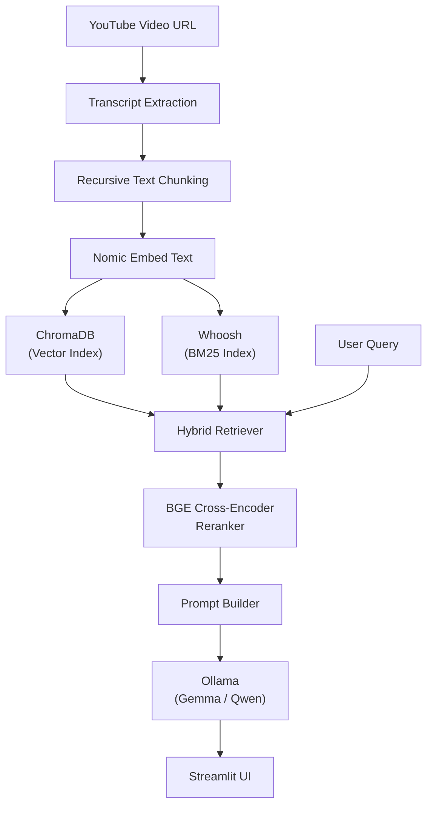

## Beacon
AI-Powered YouTube Question Answering using Hybrid Retrieval, Reranking, and Local LLMs

Transform any YouTube video into an intelligent conversational knowledge base using Retrieval-Augmented Generation (RAG).

## Overview
Beacon is an end-to-end Retrieval-Augmented Generation (RAG) system that enables users to ask natural language questions about YouTube videos and receive context-aware, citation-grounded answers.

Instead of relying solely on a Large Language Model's internal knowledge, the system retrieves the most relevant transcript chunks using a hybrid search pipeline combining semantic vector search and traditional lexical retrieval before generating responses with a local Large Language Model.

The project demonstrates modern AI engineering concepts including:

Hybrid Retrieval
Vector Databases
Dense Embeddings
Cross-Encoder Reranking
Local LLM Deployment
Dockerized AI Applications
Modular AI Pipelines

## Features

✅ YouTube Transcript Extraction

✅ Automatic Transcript Chunking

✅ Dense Embeddings using Nomic Embed

✅ Chroma Vector Database

✅ BM25 Search using Whoosh

✅ Hybrid Retrieval

✅ BGE Cross-Encoder Reranking

✅ Ollama Integration

✅ Local LLM Support (Gemma / Qwen)

✅ Dockerized Deployment

✅ Duplicate Video Detection

✅ Streamlit User Interface

## System Architecture

## How It Works

1. Transcript Extraction

The application extracts subtitles from YouTube videos using the YouTube Transcript API.

2. Chunking

Long transcripts are split into overlapping chunks for better semantic retrieval.

3. Embedding Generation

Each chunk is converted into dense vector embeddings using the Nomic Embed Text model.

4. Indexing

Every chunk is stored inside:

ChromaDB (Semantic Search)
Whoosh BM25 Index (Keyword Search)
5. Hybrid Retrieval

For every user query:

Semantic Search retrieves contextually similar chunks.
BM25 retrieves keyword-relevant chunks.
Results are merged.
6. Cross Encoder Reranking

A BGE reranker scores retrieved chunks and reorders them based on relevance.

7. Prompt Construction

Top-ranked chunks are injected into a structured prompt.

8. Answer Generation

The prompt is sent to a locally hosted Large Language Model via Ollama to generate the final response.

## Project Structure
youtube_rag/

├── app.py
├── Dockerfile
├── docker-compose.yml
├── pyproject.toml
│
├── src/
│   ├── chains/
│   ├── services/
│   ├── retrievers/
│   ├── models/
│   ├── config/
│   ├── utils/
│   └── prompts/
│
├── data/
│   ├── chroma_db/
│   └── whoosh_index/
│
├── tests/
│
└── README.md

## Tech Stack

Category	Technology
Language	Python 3.11
Framework	Streamlit
Vector Database	ChromaDB
Keyword Search	Whoosh
Embeddings	Nomic Embed
Reranker	BAAI BGE Reranker
LLM	Ollama
Models	Qwen3:8B
Containerization	Docker
Package Manager	uv

## Docker Deployment

The project is fully containerized.

Services:

Beacon Application
Ollama LLM Server

Start the application:

docker compose up --build

## Example Questions
Summarize this video.
What are the key concepts discussed?
Explain attention mechanisms.
What did the speaker say about transformers?
List all important points.

📚 Learning Outcomes

This project demonstrates practical experience with:

Retrieval-Augmented Generation (RAG)
Hybrid Search
Semantic Search
Dense Retrieval
Information Retrieval
Vector Databases
Cross Encoder Reranking
Docker
Local LLM Deployment
Modern AI Engineering Practices
📄 License

MIT License
